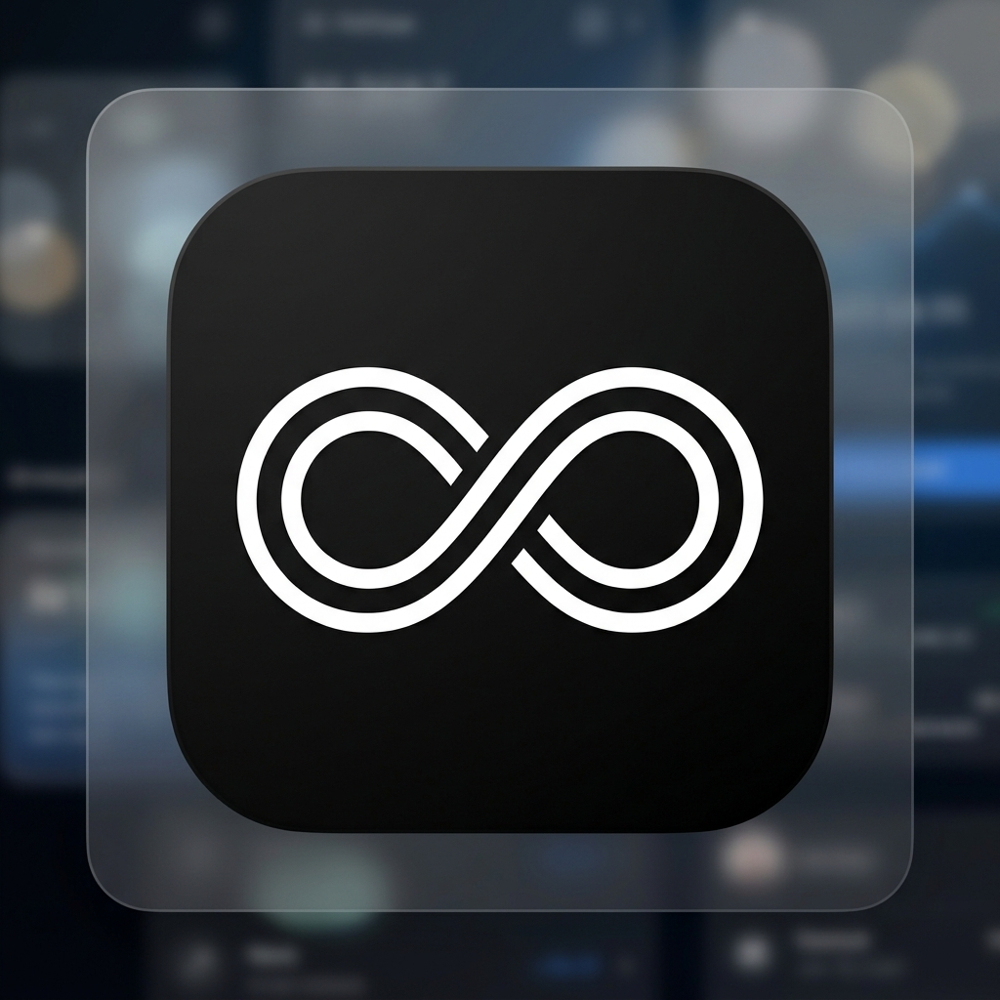

<div align="center"><a name="readme-top"></a>



<br>

# FinFlow — Intelligent Financial Terminal

[](LICENSE)
[](https://github.com/swali78/finflow-app)

</div>

FinFlow is a premium, high-density financial management terminal designed for indie hackers, freelancers, and small businesses. It combines the power of modern AI with a minimalist, terminal-like aesthetic to provide a professional-grade accounting experience.

> [!IMPORTANT]
> This repository contains the source code for the FinFlow MVP, including the Next.js web application and the Capacitor native Android bridge for the Google Play Store.

## ✨ Core Features

### 🍱 1. Intelligent Analytics Dashboard
A high-contrast, dark-themed home screen providing an instant overview of your liquid assets, monthly flow, and savings goals.
- **Generate Report**: Instant professional PDF statement generation.
- **Milestone Tracking**: Real-time progress toward your financial objectives.

### 📈 2. Insights & Anomaly Detection
Advanced financial telemetry to track your spending velocity and detect pattern anomalies.
- **Q4 Target Gauge**: Visual progression toward quarterly savings goals.
- **Spending Allocation**: AI-powered breakdown of your capital distribution.

### 📒 3. Transaction Ledger
A high-density ledger designed for professional speed and clarity.
- **Date Grouping**: Automatic chronological grouping (Today, Yesterday, By Month).
- **Multi-Category Tags**: Organize transactions by project and category with ease.

### 📱 4. Play Store Ready
Native Android integration via Capacitor with custom Kotlin entry points.
- **Full Offline Layout**: Optimized for mobile performance.
- **Native Assets**: All 87+ high-resolution icons and splash screens included.

## 🚀 Getting Started (MVP Launch)

### 1. Local Development
```bash
# Clone your repository
git clone https://github.com/swali78/finflow-app.git
cd finflow-app

# Install dependencies
npm install

# Setup environment
cp .env.production.template .env.local

# Run the dev server
npm run dev
```

### 2. Android Build
```bash
# Sync web changes to Android
npm run build
npx cap sync android

# Open in Android Studio
# Navigate to /android and Build > Generate Signed Bundle
```

## 🔐 Security & Privacy
FinFlow is built with data sovereignty at its core. Your financial data is stored in your own PostgreSQL database and is never shared or sold. Review our [Privacy Policy](PRIVACY_POLICY.md) for more details.

## 📄 License
FinFlow is licensed under the [MIT License](LICENSE).
